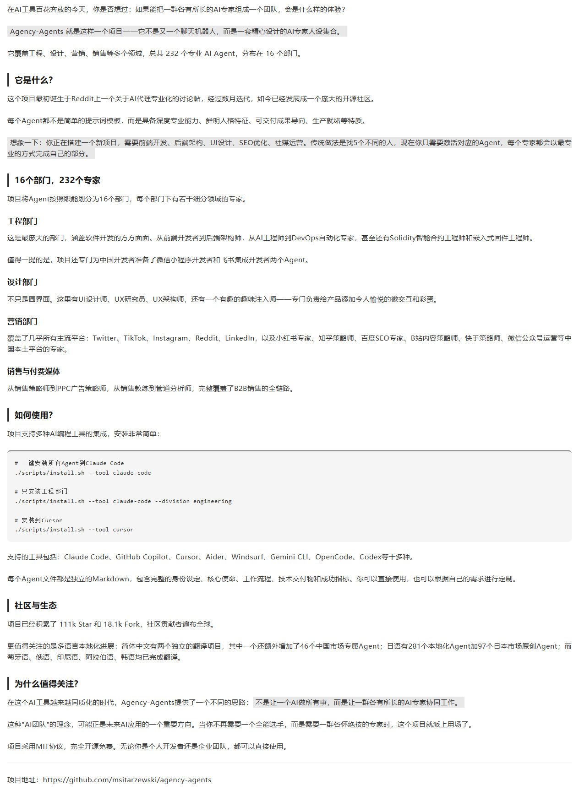
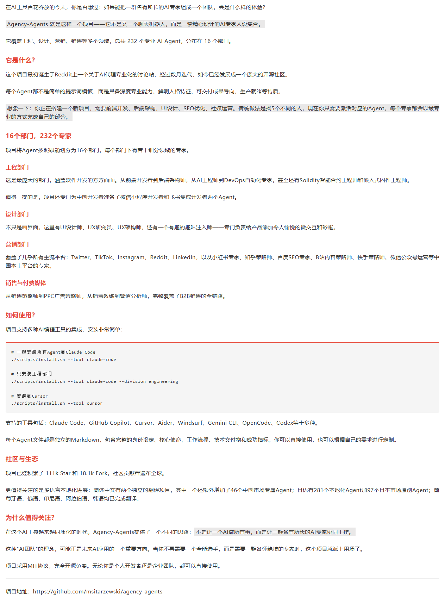
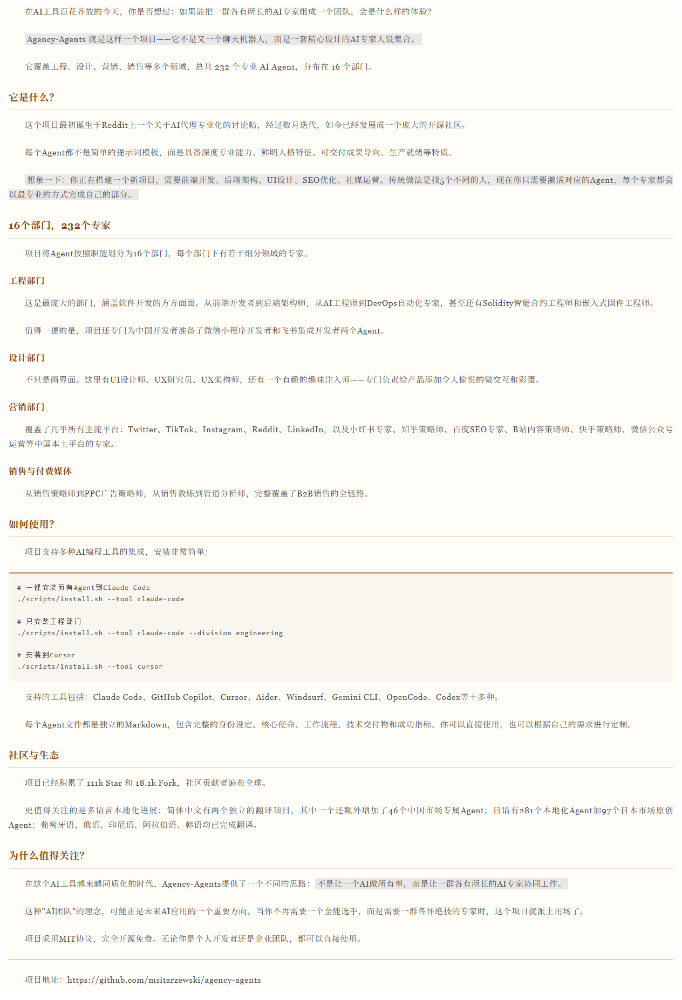
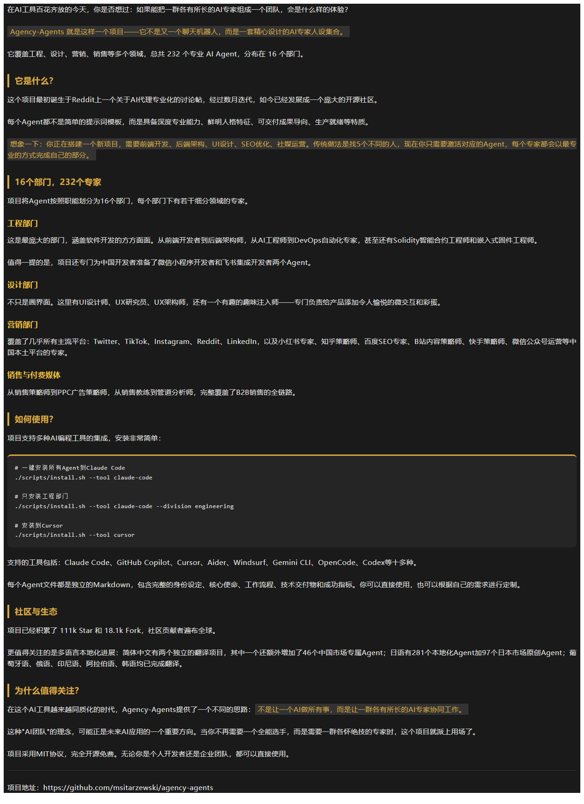
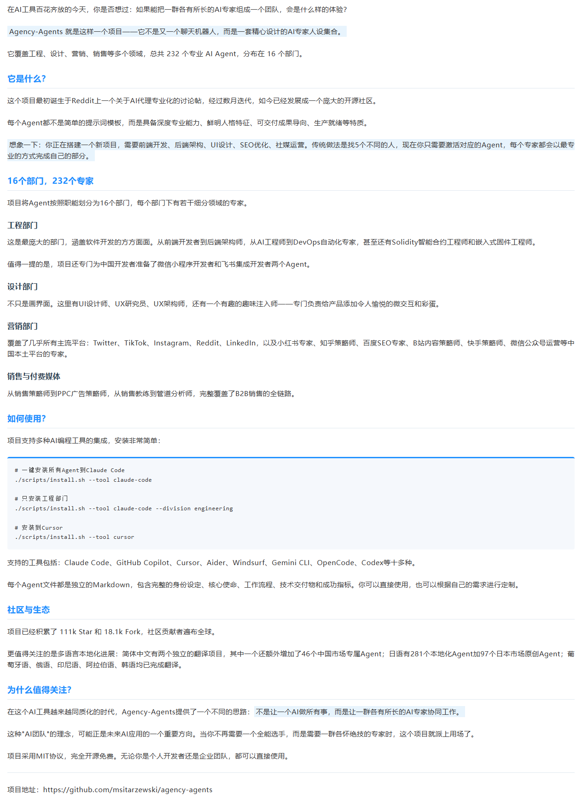
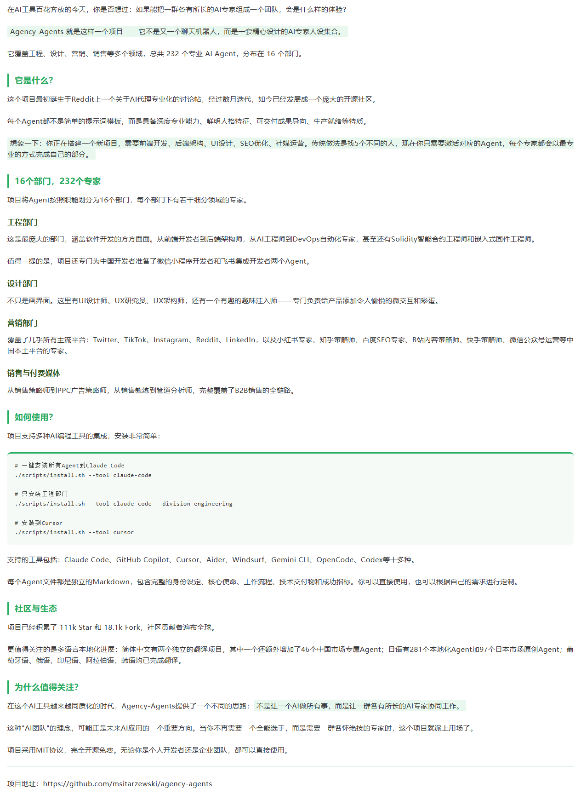
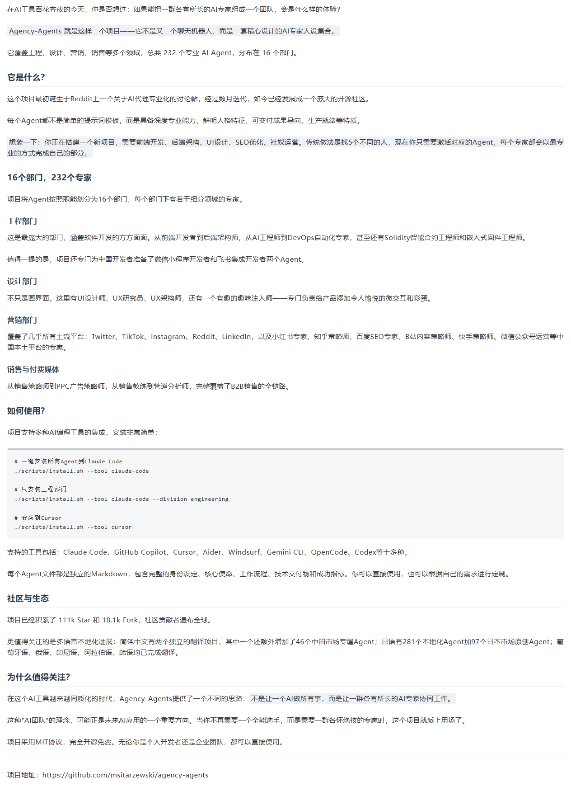
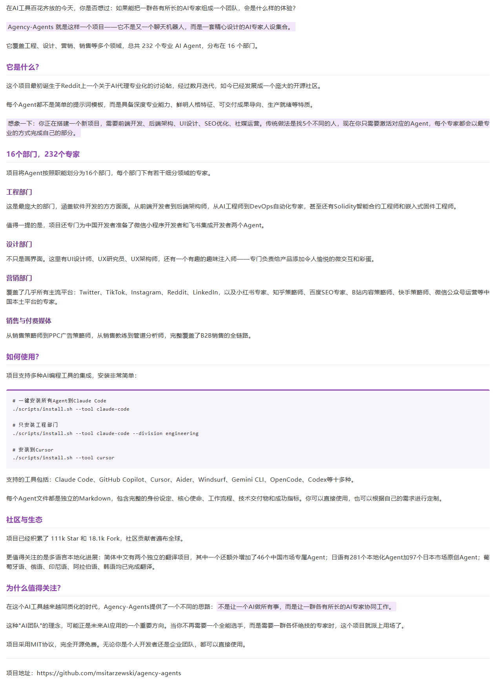
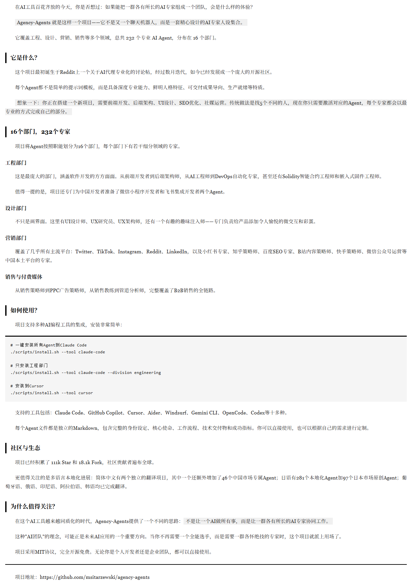

# 📝 WeChat Publisher

微信公众号文章自动发布工具。Markdown 写作 → 一键排版 → 推送草稿/发布。

## ✨ 特性

- **Markdown → 微信排版 HTML**：自动转换，内联样式，兼容微信编辑器
- **9 套排版模板**：覆盖极简、科技、文艺、商务、暗黑等多种风格
- **`==强调==` 语法**：高亮重要句子，背景色跟随模板自动适配
- **代码块美化**：浅灰背景 + 顶部装饰线 + 圆角
- **一键发布**：草稿箱 / 直接发布，支持封面图上传

## 🎨 模板预览

<table>
<tr>
<td align="center"><b>极简黑白灰</b><br><code>-t default</code><br></td>
<td align="center"><b>红色标题极简</b><br><code>-t red-minimal</code><br></td>
</tr>
<tr>
<td align="center"><b>暖色文艺</b><br><code>-t warm-literary</code><br></td>
<td align="center"><b>暗黑高级</b><br><code>-t dark-elegant</code><br></td>
</tr>
<tr>
<td align="center"><b>蓝色科技</b><br><code>-t tech-blue</code><br></td>
<td align="center"><b>清新绿色</b><br><code>-t fresh-green</code><br></td>
</tr>
<tr>
<td align="center"><b>商务灰</b><br><code>-t business-gray</code><br></td>
<td align="center"><b>紫色创意</b><br><code>-t purple-creative</code><br></td>
</tr>
<tr>
<td align="center"><b>报刊 editorial</b><br><code>-t newspaper</code><br></td>
<td></td>
</tr>
</table>

## 🚀 快速开始

```bash
pip install markdown2
```

### 仅排版

```bash
python scripts/format_wechat.py article.md -t default -o output.html
```

### 排版 + 推送草稿

```bash
python scripts/publish.py --draft output.html --title "文章标题" --cover cover.jpg
```

### 从 Markdown 一键发布

```bash
python scripts/publish.py --from-md article.md --title "文章标题" --cover cover.jpg
```

## 📝 排版语法

### 强调文字

用 `==文字==` 标记需要高亮的句子，背景色自动适配模板：

```markdown
这是一个==重要观点==，需要特别注意。
```

### 代码块

标准 Markdown 代码块，自动渲染为浅灰背景 + 顶部装饰线：

````markdown
```bash
echo "Hello World"
```
````

## ⚙️ 配置

首次使用需配置公众号凭证，编辑 `scripts/config.json`：

```json
{
    "app_id": "你的AppID",
    "app_secret": "你的AppSecret",
    "author": "作者名"
}
```

### IP 白名单

登录 [mp.weixin.qq.com](https://mp.weixin.qq.com) → 设置与开发 → 基本配置 → IP白名单，添加你的公网 IP。

## 📁 项目结构

```
wechat-publisher/
├── scripts/
│   ├── format_wechat.py      # 排版引擎
│   ├── publish.py            # 发布脚本
│   └── config.json           # 凭证配置（git忽略）
├── templates/                # 9套排版模板
├── examples/                 # 模板效果截图
├── references/               # 配置指南
└── output/                   # 生成文件（git忽略）
```

## 📄 License

MIT
